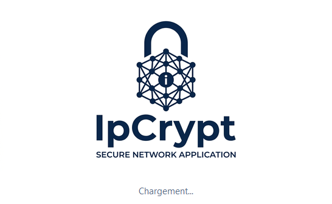
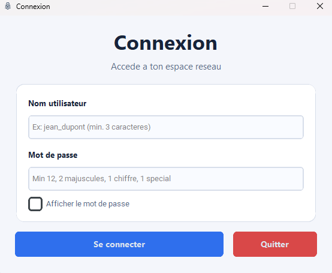
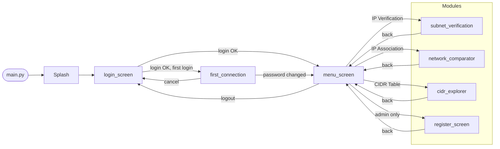
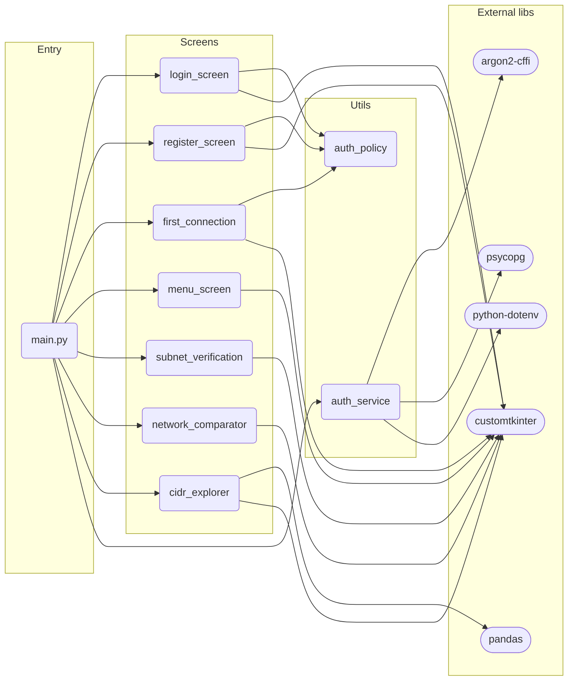

<div align="center">


# IpCrypt

Desktop network tool — Python + CustomTkinter.
IP verification, subnet analysis, cross-network association, CIDR table, user management.


[](https://github.com/Coco-Lapin/IpCrypt/actions/workflows/discord_push.yml)

</div>

<p align="center">
  <a href="#quick-start">Quick Start</a> •
  <a href="#architecture">Architecture</a> •
  <a href="#modules">Modules</a> •
  <a href="#roadmap">Roadmap</a>
</p>

---

## Table of Contents

- [About](#about)
- [Features](#features)
- [Screenshots](#screenshots)
- [Architecture](#architecture)
- [Project Structure](#project-structure)
- [Tech Stack](#tech-stack)
- [Quick Start](#quick-start)
- [Modules](#modules)
- [Password Policy](#password-policy)
- [Roadmap](#roadmap)

---

## About

IpCrypt is a Python desktop application built for the BAC2 Systems & Networks curriculum.
It provides a GUI-first approach to common IP addressing tasks — class detection, subnet calculation, cross-network visibility, and CIDR table generation — all without relying on any Python networking library (`ipaddress`, `socket`, etc.).

User access is controlled via login (admin / client profiles). Accounts and hashed passwords are persisted in a PostgreSQL database. Admins get access to the user registration module. Newly created accounts are forced to change their password on first login.

---

## Features

| Module | Status | Description |
|---|---|---|
| Splash screen | Done | Animated loading screen on startup |
| Login | Done | Username + password with policy enforcement |
| First connection | Done | Forced password change on first login for admin-created accounts |
| Registration | Done | Admin-only user creation with profile selection |
| Menu | Done | Role-aware navigation (admin vs client) |
| IP Verification | Done | Class detection, broadcast/network/host classification |
| IP Association | Done | Bilateral cross-network visibility check |
| CIDR Table | Done | /8–/30 matrix with binary + decimal + Excel export |

---

## Screenshots

<div align="center">
    <table>
        <tr>
            <td align="center"><strong>Splash</strong><br/></td>
            <td align="center"><strong>Connexion</strong><br/></td>
            <td align="center"><strong>Inscription</strong><br/></td>
        </tr>
        <tr>
            <td align="center"><strong>Menu</strong><br/></td>
            <td align="center"><strong>Verification IP</strong><br/></td>
            <td align="center"><strong>Association IP</strong><br/></td>
        </tr>
        <tr>
            <td align="center"><strong>Tableau CIDR</strong><br/></td>
            <td></td>
            <td></td>
        </tr>
    </table>
</div>

---

## Architecture

The app uses a **sequential window model**: each screen is a `ctk.CTk()` instance that calls `mainloop()`, cleans up, then invokes a navigation callback to open the next screen. No multi-threading, no persistent root window.

All screens use a **deferred navigation pattern**: button clicks store a callback in `next_action`, call `app.quit()` to exit `mainloop()`, then `cleanup_window()` drains pending `after()` callbacks before `destroy()` to avoid `TclError` on dead widgets. Only after full cleanup is the next screen opened.

### Navigation flow



### Module dependencies



---

## Project Structure

```text
IpCrypt/
├── .env.example                    # DB credentials template
├── code/
│   ├── main.py                     # Entry point — splash, navigation callbacks
│   ├── requirements.txt
│   ├── screens/
│   │   ├── login_screen.py         # Login form + credential check
│   │   ├── first_connection.py     # Forced password change on first login
│   │   ├── register_screen.py      # Admin-only user creation
│   │   ├── menu_screen.py          # Role-aware module selector
│   │   ├── subnet_verification.py  # IP class + broadcast/network/host check
│   │   ├── network_comparator.py   # AND-based network calc, bilateral visibility
│   │   ├── cidr_explorer.py        # CIDR matrix /8–/30, xlsx export
│   │   ├── definer_classe.py       # Standalone: class + public/private detection
│   │   ├── get_mask.py             # Standalone: classful mask from IP
│   │   └── get_network.py          # Standalone: network + subnet address calc
│   ├── utils/
│   │   ├── auth_policy.py          # Password rule validator (parametric)
│   │   └── auth_service.py         # Argon2 hashing + PostgreSQL ops
│   ├── Controller/                 # Legacy / experimental controllers (not wired to main)
│   │   ├── GenerationTableau.py
│   │   ├── InfosIP.py
│   │   ├── MenuHome.py
│   │   ├── inscription_controller.py
│   │   ├── ip_association.py
│   │   └── menu_controller.py
│   ├── database/
│   │   └── connection.sql          # PostgreSQL schema
│   └── images/
│       ├── iconeIpCrypt.ico
│       ├── menuIpCrypt.ico
│       └── menuIpCrypt.png
```

---

## Tech Stack

- **Python 3.10+**
- **CustomTkinter 5.2.2** — themed widgets
- **Pillow 12** — splash screen image rendering
- **pandas 3** — CIDR table Excel export
- **argon2-cffi** — password hashing (Argon2)
- **psycopg 3** (`psycopg[binary]`) — PostgreSQL connector (Supabase)
- **python-dotenv** — DB credentials via `.env`
- No IP networking library — all calculations are manual bit operations

---

## Pourquoi sans bibliothèque réseau ?

Python fournit `ipaddress`, `socket`, et d'autres modules qui font tout le travail réseau en une ligne.
IpCrypt n'en utilise aucun — toutes les opérations sont implémentées à la main :

| Opération | Implémentation |
|---|---|
| Détection de classe | Comparaison de plages sur le 1er octet (`1–126` → A, `128–191` → B…) |
| Masque classful | `match/case` sur la classe détectée |
| Adresse réseau | ET binaire octet par octet (`IP[i] & masque[i]`) |
| Adresse broadcast | Remplace les octets hôtes par `255` selon la classe |
| Table CIDR | Génération des masques par décalage de bits (`0xFFFFFFFF << (32 - prefix)`) |
| Type d'adresse | Comparaison de plages RFC 1918 (`10.x`, `172.16–31.x`, `192.168.x`) |

C'est un choix pédagogique : l'objectif est de comprendre et recoder la logique réseau, pas de déléguer à une lib.

---

## Schéma de la base de données

Base hébergée sur **Supabase** (PostgreSQL).

```sql
CREATE TABLE users (
    user_id          BIGSERIAL PRIMARY KEY,
    username         VARCHAR(50) NOT NULL UNIQUE,
    password         TEXT        NOT NULL,          -- hash Argon2id
    is_admin         BOOLEAN     NOT NULL DEFAULT FALSE,
    is_firstConnexion BOOLEAN    NOT NULL DEFAULT TRUE
);
```

| Colonne | Type | Rôle |
|---|---|---|
| `user_id` | BIGSERIAL | Clé primaire auto-incrémentée |
| `username` | VARCHAR(50) | Identifiant unique de connexion |
| `password` | TEXT | Hash Argon2id (jamais le mot de passe en clair) |
| `is_admin` | BOOLEAN | `true` → accès module inscription + toutes fonctions |
| `is_firstConnexion` | BOOLEAN | `true` → forçage changement de mot de passe au prochain login |

---

## Quick Start

### 1. Clone

```bash
git clone <repo-url>
cd IpCrypt
```

### 2. Virtual environment

```bash
python -m venv .venv

# Windows
.\.venv\Scripts\Activate.ps1

# Linux / macOS
source .venv/bin/activate
```

### 3. Install dependencies

```bash
pip install -r code/requirements.txt
```

### 4. Configure database credentials

```bash
cp .env.example .env
# Edit .env with your PostgreSQL host, user, password, dbname
```

### 5. Database setup

```bash
psql -U <user> -d <dbname> -f code/database/connection.sql
```

### 6. Run

```bash
cd code
python main.py
```

---

## Modules

### Login (`screens/login_screen.py`)

- Username + password fields with show/hide toggle
- Delegates credential verification to `utils/auth_service.py`
- On success: checks `is_firstconnexion` flag — routes to first connection screen or menu

### First Connection (`screens/first_connection.py`)

- Triggered automatically when `is_firstconnexion = true` in DB
- Forces the user to choose a new password before accessing the menu
- Policy-validated (same rules as registration)
- Confirm field stays masked by design — user must retype from memory

### Registration (`screens/register_screen.py`)

- Accessible from menu by admin only
- Profile selector: Client / Admin
- Delegates hashing + DB insert to `utils/auth_service.py`
- Created accounts have `is_firstconnexion = true` — forced password change on first login

### Menu (`screens/menu_screen.py`)

- Radio-button module selector with dispatch table
- Admin view: Register, IP Verification, IP Association, CIDR Table
- Client view: IP Verification, IP Association, CIDR Table

### IP Verification (`screens/subnet_verification.py`)

- Octet-by-octet input with real-time key validation (0–255 only, max 3 digits)
- Detects: broadcast address, network address, or valid host — per class (A/B/C)
- Class detection via first octet range matching

### IP Association (`screens/network_comparator.py`)

- Two IP + mask pairs (octet groups)
- AND-based network address calculation via `calcule_adresse_reseau()`
- Bilateral check: A sees B / B sees A / mutual / none
- Results displayed inline

### CIDR Table (`screens/cidr_explorer.py`)

- Generates /8 to /30 (23 rows) via `build_cidr_rows()`
- Columns: CIDR notation, binary mask (dotted), decimal mask
- Export to `.xlsx` via file dialog

### Standalone screens (not wired to main navigation)

| File | What it does |
|---|---|
| `definer_classe.py` | Class (A–E) + public/private/loopback/APIPA type detection |
| `get_mask.py` | Classful mask from first octet |
| `get_network.py` | Network address (classful) + subnet address (AND with mask) |

---

## Password Policy

Enforced at registration and first connection via `utils/auth_policy.py`:

| Rule | Value |
|---|---|
| Minimum length | 12 characters |
| Minimum lowercase | 1 |
| Minimum uppercase | 2 |
| Minimum digits | 1 |
| Minimum special chars | 1 |

The validator is parametric — thresholds can be adjusted per call site. Policy is **not** checked at login (only at password creation/change).

---

## Roadmap

- [x] IP Verification business logic (class detection, broadcast, host range)
- [x] Input validation on IP Verification (per-key octet validation 0–255)
- [x] First connection flow (forced password change for admin-created accounts)
- [x] DB credentials via `.env` (python-dotenv)
- [ ] Centralize shared UI helpers (`COLORS`, `center_window`, `cleanup_window`) into `screens/shared.py` — currently duplicated in every screen
- [ ] Wire standalone screens (`definer_classe`, `get_mask`, `get_network`) into a unified IP Verification module or sub-navigation
- [ ] Unit tests for network calculation functions (`calcule_adresse_reseau`, `build_cidr_rows`, `verificationIP`)
- [ ] Server-side admin access enforcement (currently only UI flag)
- [ ] Clean up or integrate `code/Controller/` legacy files

---

## Author

Project built as part of the BAC2 SR curriculum — Phase 2.
