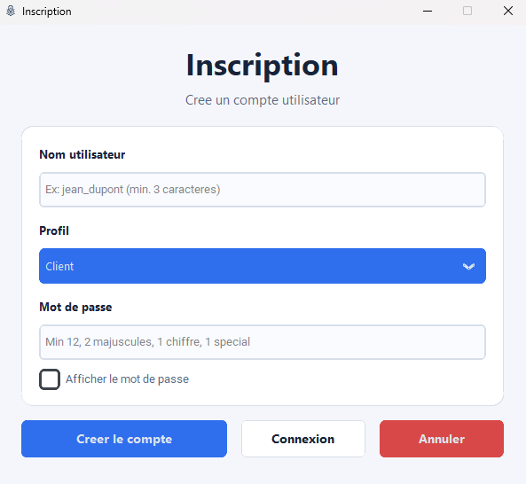
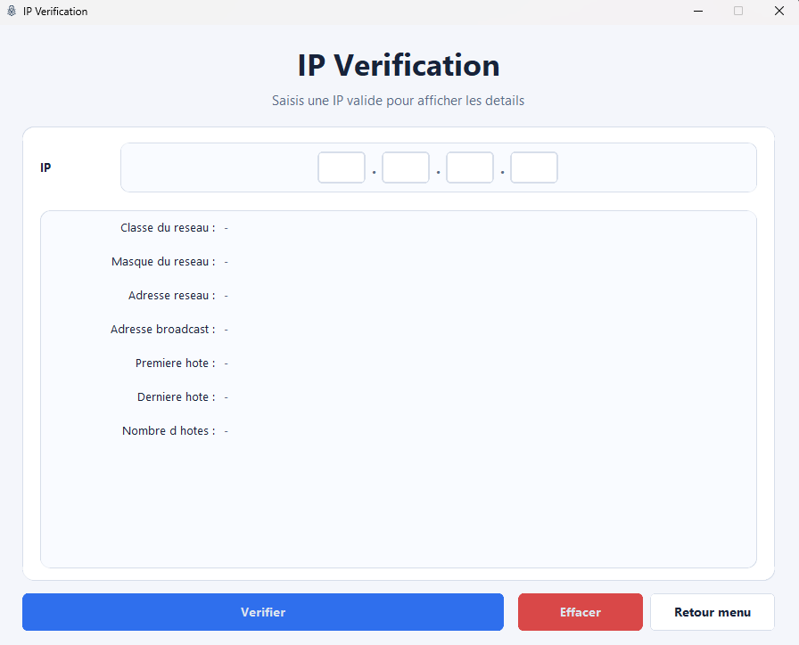
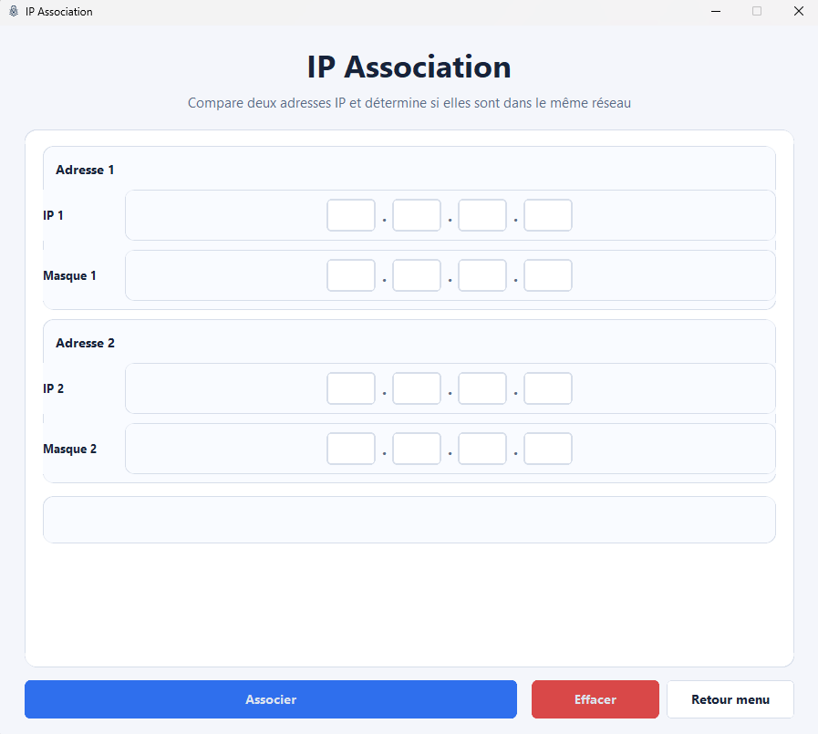
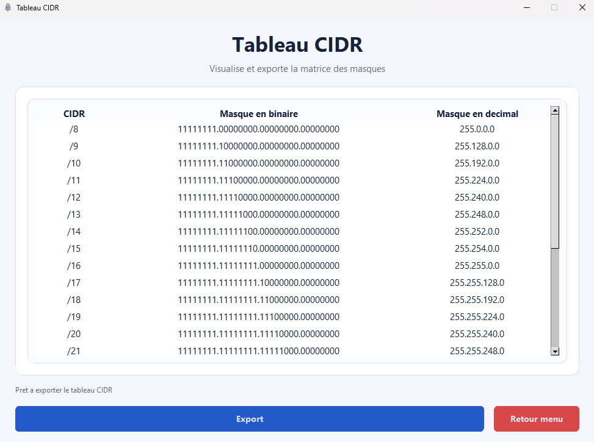
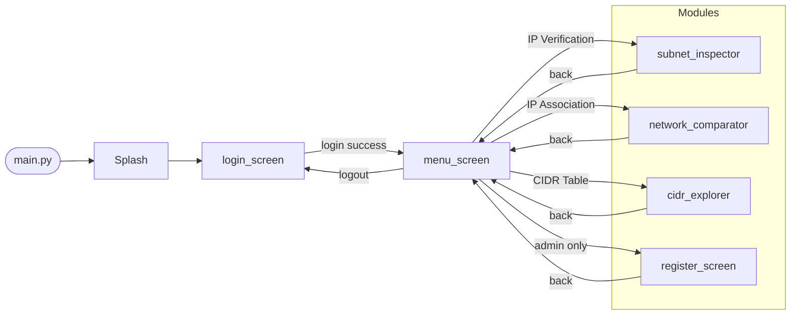
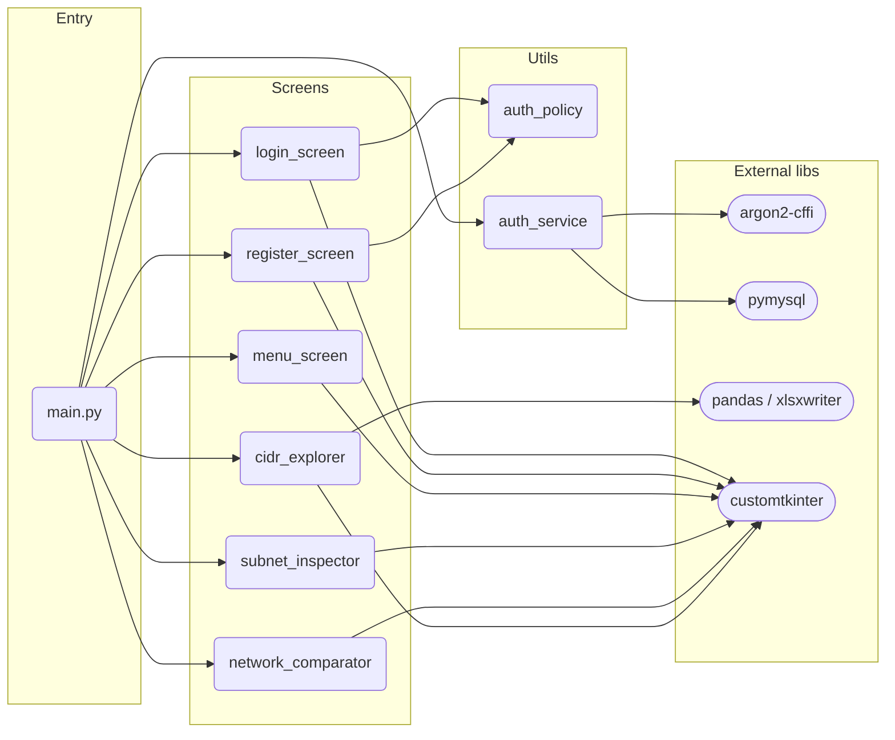

<div align="center">


# IpCrypt

Desktop network tool — Python + CustomTkinter.
IP verification, subnet analysis, cross-network association, CIDR table, user management.


</div>

<p align="center">
  <a href="#quick-start">Quick Start</a> •
  <a href="#architecture">Architecture</a> •
  <a href="#modules">Modules</a> •
  <a href="#roadmap">Roadmap</a>
</p>

---

## Table of Contents

- [About](#about)
- [Features](#features)
- [Demo](#demo)
- [Architecture](#architecture)
- [Project Structure](#project-structure)
- [Tech Stack](#tech-stack)
- [Quick Start](#quick-start)
- [Modules](#modules)
- [Password Policy](#password-policy)
- [Roadmap](#roadmap)

---

## About

IpCrypt is a Python desktop application built for the BAC2 Systems & Networks curriculum.
It provides a GUI-first approach to common IP addressing tasks — class detection, subnet calculation, cross-network visibility, and CIDR table generation — all without relying on any Python networking library (`ipaddress`, `socket`, etc.).

User access is controlled via login (admin / client profiles). Accounts and hashed passwords are persisted in a MySQL database. Admins get access to the user registration module.

---

## Features

| Module | Status | Description | Images |
|---|---|---|---|
| Splash screen | Done | Animated loading screen on startup | 
| Login | Done | Username + password with policy enforcement | 
| Registration | Done | Admin-only user creation with profile selection | 
| Menu | Done | Role-aware navigation (admin vs client) | 
| IP Verification | In progress | Class, reserved/private flags, broadcast, host range | 
| IP Association | Done | Bilateral cross-network visibility check | 
| CIDR Table | Done | /8–/30 matrix with binary + decimal + Excel export | 

---

## Demo

<div align="center">
  
</div>

> 📝 **Add your demo GIF here:** Place a `demo.gif` file in the `code/images/` directory to show the application workflow (e.g., login → menu → module navigation).

---

## Architecture

The app uses a **sequential window model**: each screen is a `ctk.CTk()` instance that calls `mainloop()`, cleans up, then invokes a navigation callback to open the next screen. No multi-threading, no persistent root window.

### Navigation flow



### Module dependencies



---

## Project Structure

```text
IpCrypt/
├── main.py
├── screens/
│   ├── login_screen.py          # was connexion_ui.py
│   ├── register_screen.py       # was inscription_ui.py
│   ├── menu_screen.py           # was menu_ui.py
│   ├── subnet_inspector.py      # was ip_verification_ui.py  — class detection, broadcast, host range
│   ├── network_comparator.py    # was ip_association_ui.py   — AND-based network calc, bilateral check
│   └── cidr_explorer.py         # was cidr_table_ui.py       — CIDR matrix, binary↔decimal, xlsx export
├── utils/
│   ├── auth_policy.py           # was password_policy.py
│   └── auth_service.py          # was password_verification.py — argon2 hashing + DB ops
├── database/
│   └── connection.sql
├── images/
│   ├── iconeIpCrypt.ico
│   ├── menuIpCrypt.ico
│   └── menuIpCrypt.png
└── requirements.txt
```

---

## Tech Stack

- **Python 3.10+**
- **CustomTkinter 5.x** — themed widgets
- **Pillow** — splash screen image rendering
- **pandas + xlsxwriter** — CIDR table Excel export
- **argon2-cffi** — password hashing
- **pymysql** — MySQL connector
- No IP networking library used — all calculations are manual bit operations

---

## Quick Start

### 1. Clone

```bash
git clone <repo-url>
cd IpCrypt
```

### 2. Virtual environment

```bash
python -m venv .venv

# Windows
.\.venv\Scripts\Activate.ps1

# Linux / macOS
source .venv/bin/activate
```

### 3. Install dependencies

```bash
pip install -r requirements.txt
```

Or manually:

```bash
pip install customtkinter pillow pandas xlsxwriter argon2-cffi pymysql
```

### 4. Database setup

```bash
mysql -u root -p < database/connection.sql
```

### 5. Run

```bash
python main.py
```

---

## Modules

### Login (`screens/login_screen.py`)

- Username (min 3 chars) + password fields
- Password show/hide toggle
- Delegates credential verification to `utils/auth_service.py`
- On success: routes to menu with admin flag

### Registration (`screens/register_screen.py`)

- Accessible from menu by admin only
- Profile selector: Client / Admin
- Delegates hashing + DB insert to `utils/auth_service.py`

### Menu (`screens/menu_screen.py`)

- Radio-button module selector
- Admin view: Register, IP Verification, IP Association, CIDR Table
- Client view: IP Verification, IP Association, CIDR Table

### IP Verification (`screens/subnet_inspector.py`)

- Octet-by-octet input with validation (0–255)
- Outputs: IP class, reserved/private flag, class mask, network address, broadcast, first/last host, host count
- Status: UI done, business logic in progress

### IP Association (`screens/network_comparator.py`)

- Two IP + mask pairs (octet groups)
- AND-based network address calculation via `calcule_adresse_reseau()`
- Bilateral check: A sees B / B sees A / mutual / none
- Results displayed inline

### CIDR Table (`screens/cidr_explorer.py`)

- Generates /8 to /30 (23 rows) via `build_cidr_rows()`
- Columns: CIDR notation, binary mask (dotted), decimal mask
- Export to `.xlsx` via file dialog

---

## Password Policy

Enforced at both login and registration via `utils/auth_policy.py`:

| Rule | Value |
|---|---|
| Minimum length | 12 characters |
| Minimum uppercase | 2 |
| Minimum digits | 1 |
| Minimum special chars | 1 |

The validator is parametric — thresholds can be adjusted per call site.

---

## Roadmap

- [ ] Wire IP Verification business logic (class detection, broadcast, host range)
- [ ] Input validation on IP Verification (currently no octet validation)
- [ ] Centralize shared UI constants (`COLORS`, `center_window`, `cleanup_window`) into `screens/shared.py`
- [ ] Move DB credentials to `.env` / environment variables
- [ ] Unit tests for network calculation functions (`calcule_adresse_reseau`, `build_cidr_rows`)
- [ ] Add IP class mask deduction (classful)
- [ ] Restrict admin access enforcement server-side (not just UI flag)

---

## Author

Project built as part of the BAC2 SR curriculum — Phase 1.
