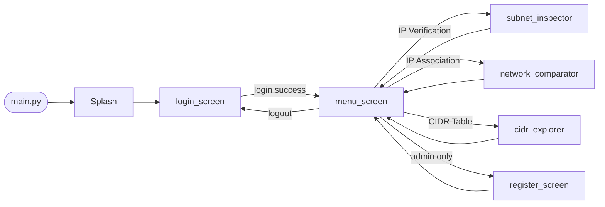

<div align="center">


# IpCrypt

Desktop network tool — Python + CustomTkinter.  
IP verification, subnet analysis, cross-network association, CIDR table, user management.


</div>

<p align="center">
  <a href="#demo">Demo</a> •
  <a href="#screenshots">Screenshots</a> •
  <a href="#quick-start">Quick Start</a> •
  <a href="#architecture">Architecture</a> •
  <a href="#modules">Modules</a>
</p>

---

## 🎬 Demo

> ⚠️ À venir — ajoute ton GIF ici

<p align="center">
  
</p>

---

## 🖼️ Screenshots

### 🔐 Login
<p align="center">
  
</p>

### 📝 Register (Admin)
<p align="center">
  
</p>

### 🧭 Menu principal
<p align="center">
  
</p>

### 🌐 IP Verification
<p align="center">
  
</p>

### 🔗 IP Association
<p align="center">
  
</p>

### 📊 CIDR Table
<p align="center">
  
</p>

---

## 📚 Table of Contents

- [About](#about)
- [Features](#features)
- [Architecture](#architecture)
- [Project Structure](#project-structure)
- [Tech Stack](#tech-stack)
- [Quick Start](#quick-start)
- [Modules](#modules)
- [Password Policy](#password-policy)
- [Roadmap](#roadmap)

---

## 🧠 About

IpCrypt is a Python desktop application built for the BAC2 Systems & Networks curriculum.

It provides a GUI-first approach to common IP addressing tasks:
- Class detection
- Subnet calculation
- Cross-network visibility
- CIDR table generation  

⚠️ All calculations are implemented **manually** (no `ipaddress`, `socket`, etc.)

User access is controlled via authentication (admin / client), with credentials stored securely in a MySQL database.

---

## 🚀 Features

| Module | Status | Description |
|---|---|---|
| Splash screen | Done | Animated loading screen |
| Login | Done | Secure authentication |
| Registration | Done | Admin-only user creation |
| Menu | Done | Role-based navigation |
| IP Verification | In progress | Full subnet analysis |
| IP Association | Done | Network comparison |
| CIDR Table | Done | CIDR matrix + Excel export |

---

## 🏗️ Architecture

The app uses a **sequential window model**:
- Each screen is independent (`CTk`)
- No threading
- Clean navigation flow

### Navigation flow



---

## 📁 Project Structure

```text
IpCrypt/
├── main.py
├── screens/
├── utils/
├── database/
├── images/
└── requirements.txt
```

---

## 🧰 Tech Stack

- Python 3.10+
- CustomTkinter
- Pillow
- pandas + xlsxwriter
- argon2-cffi
- pymysql

---

## ⚡ Quick Start

### 1. Clone

```bash
git clone <repo-url>
cd IpCrypt
```

### 2. Virtual environment

```bash
python -m venv .venv

# Windows
.\.venv\Scripts\Activate.ps1

# Linux / macOS
source .venv/bin/activate
```

### 3. Install

```bash
pip install -r requirements.txt
```

### 4. Database

```bash
mysql -u root -p < database/connection.sql
```

### 5. Run

```bash
python main.py
```

---

## 🧩 Modules

### 🔐 Login
- Username + password
- Validation + policy enforcement
- Redirect to menu

### 📝 Registration
- Admin only
- User creation + hashing

### 🧭 Menu
- Role-based UI
- Navigation hub

### 🌐 IP Verification
- Class detection
- Broadcast / host range
- (logic en cours)

### 🔗 IP Association
- Compare 2 réseaux
- Vérification bidirectionnelle

### 📊 CIDR Table
- /8 → /30
- Export Excel

---

## 🔒 Password Policy

| Rule | Value |
|---|---|
| Length | 12+ |
| Uppercase | 2 |
| Digits | 1 |
| Special chars | 1 |

---

## 🛣️ Roadmap

- [ ] Finaliser IP Verification
- [ ] Validation complète des inputs
- [ ] Centraliser UI constants
- [ ] Ajouter `.env` pour DB
- [ ] Tests unitaires
- [ ] Sécurité backend admin

---

## 📸 Images (IMPORTANT)

Ton chemin local :
C:\Users\Corentin\Desktop\BAC2\5.SR\Projet-Phase1\code\images

➡️ Sur GitHub utilise uniquement :
images/nom_image.png

Structure recommandée :
images/
├── login.png
├── register.png
├── menu.png
├── ip_verification.png
├── ip_association.png
├── cidr_table.png
├── demo.gif

---

## 👨‍💻 Author

Projet réalisé dans le cadre du BAC2 Systèmes & Réseaux — Phase 1.
